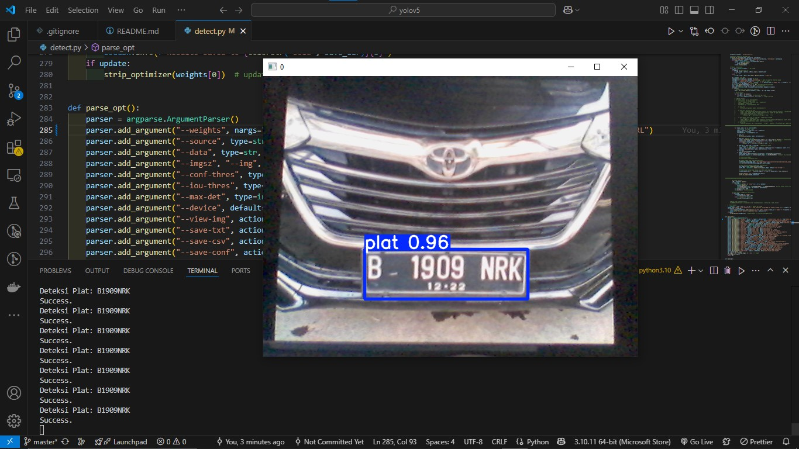

## Number Plate Recognition with Optical Character Recognition

This code is not open source, it is for my personal portfolio. If you want open source, please visit [simple-npr](https://github.com/JosuaLimbu/npr-tesseract)

Number Plate Recognition (NPR), also known as Automatic Number Plate Recognition (ANPR) or License Plate Recognition (LPR), is a technology used to automatically detect and recognize vehicle license plates. The system uses an optical camera and character recognition (OCR) software to capture images of license plates from passing vehicles, then analyzes the images to recognize and extract the text contained within. In some cases, a Convolutional Neural Network (CNN), a type of deep learning algorithm designed for image recognition, is used to improve the accuracy of character recognition. CNNs are capable of automatically learning features from images, allowing them to recognize distorted or partially obscured characters on license plates. Upon successful reading using OCR or CNN, the extracted license plate data is stored in a MySQL database. This code is integrated into the [U-Park](https://github.com/JosuaLimbu/u-park/) web system using PHP.

This research has been published in IEEE Xplore. You can access the publication at [IEEE](https://ieeexplore.ieee.org/document/10903750).

### Install

**Install on Windows**

Install [Git Bash](https://git-scm.com/downloads), [Python](https://www.python.org/downloads/) and [Tesseract](https://sourceforge.net/projects/tesseract-ocr.mirror/) first

After that, open git bash and follow these commands

```bash
$ git clone https://github.com/JosuaLimbu/npr-with-ocr.git
$ cd npr-with-ocr
$ pip install -r requirements.txt
$ python3 detect.py
```

## Performance Evaluation

**Precison-Recall Value**


The training results demonstrated high performance, with an average precision-recall value reaching 0.953 mAP@0.5 in relation to the recall, The precision-recall curve is shown, indicating the model's performance in accurately detecting objects.

**Recall-Confidence Value**


The highest average recall reaches 0.97 at a confidence level of 0.00

**The Results of the Training Data Evaluation**


All test results are stored in the directory runs/train/exp. The tests were conducted using the parameters batch = 16 and epoch = 50

**F1-Confidence Value**


The peak F1 score reaches 0.93 at a confidence level of 0.516

**Precision-Confidence Value**


The Precision score reaches 1.00 at a confidence level of 0.966

**Confusion Matrix**


A confusion matrix is a valuable tool for assessing the effectiveness of a classification model, displaying the counts of correct and incorrect predictions for each category. It provides insights into true positives (TP), true negatives (TN), false positives (FP), and false negatives (FN), which are essential for calculating additional metrics like accuracy, precision, and recall. Analyzing the confusion matrix helps researchers understand the model's strengths and weaknesses in classifying different categories, enabling more targeted improvements in future iterations.

The end result will be like this.



And the display results if integrated into a [U-Park](https://github.com/JosuaLimbu/u-park/) Web Application like this


